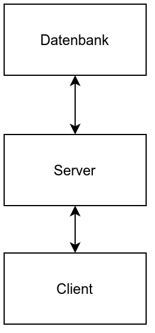
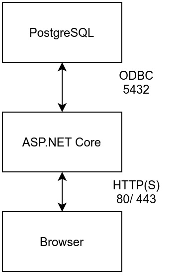
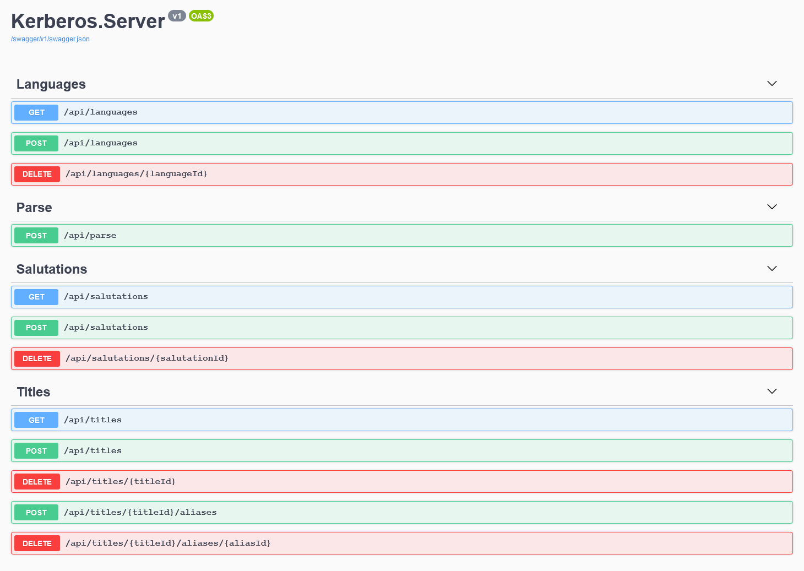
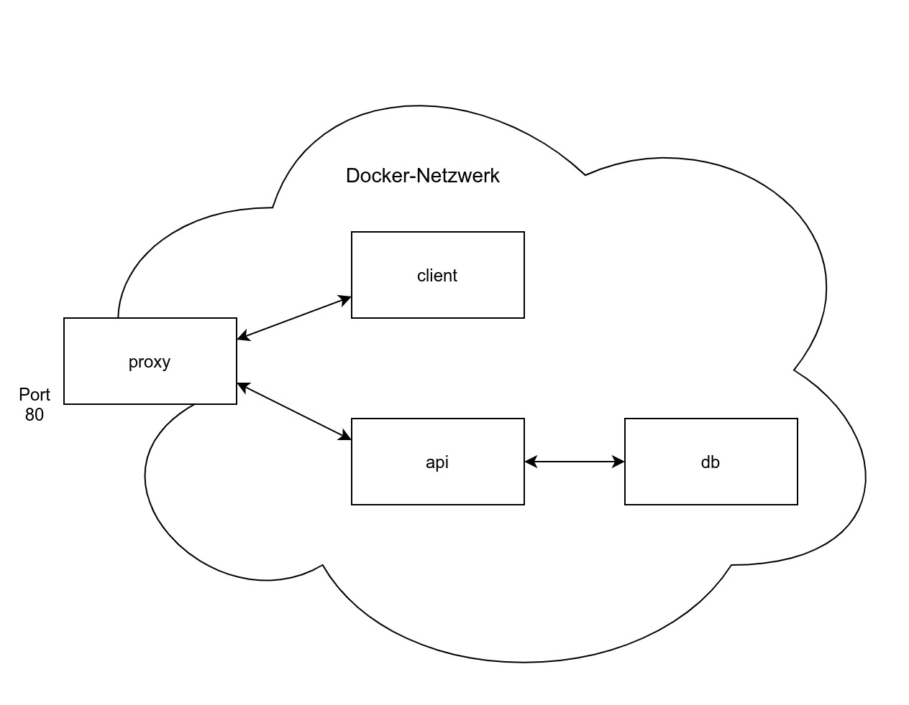

# Design

## Allgemeine Architektur
Die Applikation ist in einer Client-Server-Architektur aufgebaut. 

Dem Benutzer ist es also möglich über einen beliebigen Browser Zugriff auf die Applikation zu bekommen. Der Server bearbeitet dann die Anfragen des Clients und speichert seine Daten persistent in einer Datenbank. Es handelt sich hierbei um ein verteiltes System von kooperierenden Servern.

Die Kommunikation zwischen dem Client und Server wird über eine REST-API abgehandelt. Nachfolgend findet sich die Definition der Endpunkte dieser.

## Hosting Architektur
Um den Server bereitzustellen wurde folgende Docker-Architektur aufgestellt.

