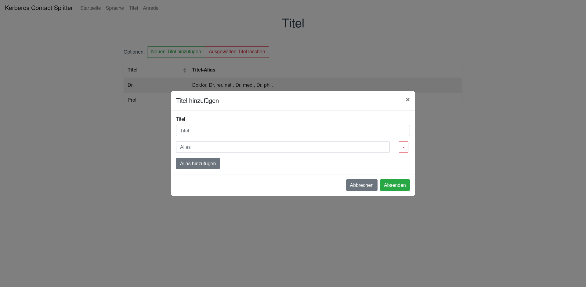
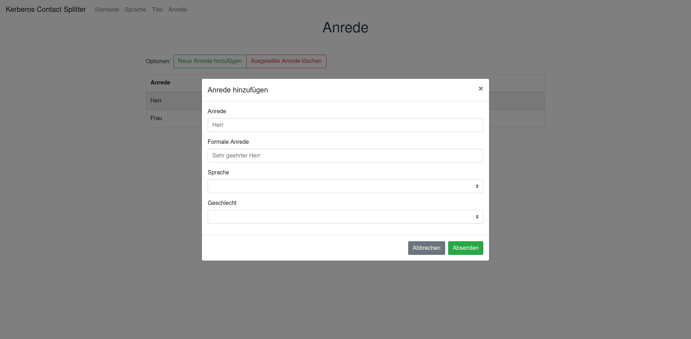
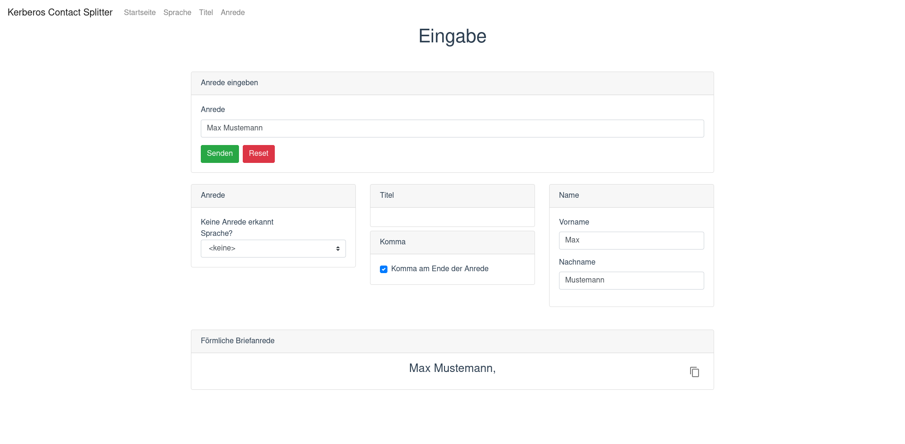
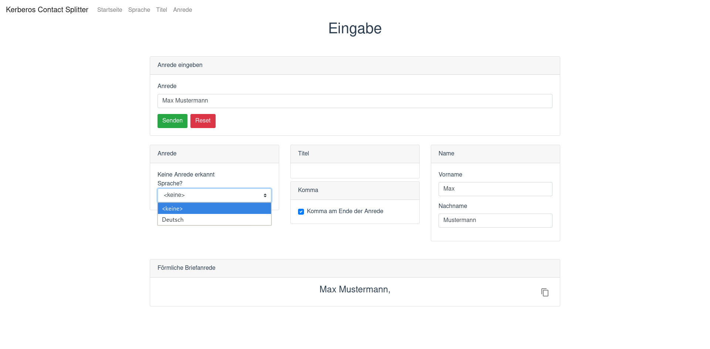
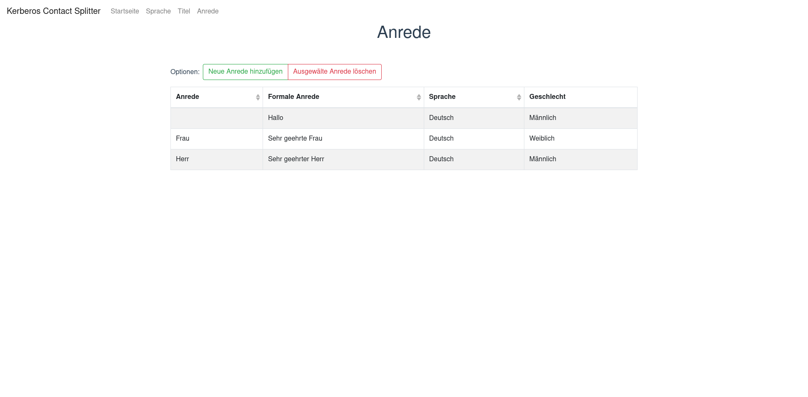
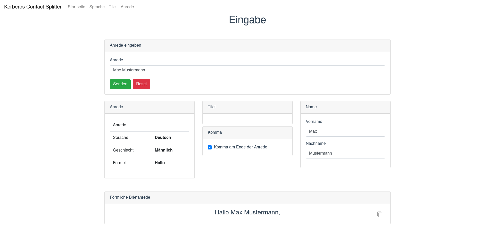

# Release Notes

## Startseite
Auf der Startseite kann eine Anrede, welche in das Eingabefeld eingegeben wurde, in folgende Bestandteile aufgeteilt werden.
* Anrede
* Sprache
* Geschlecht
* Titel
* Vorname
* Nachname

Hierbei geschieht dies nur, falls diese aus der Anrede herausgelesen werden können.

Zusätzlich gibt es, als Ausgabe eine ... 
* Standardisierte Briefanrede 
* Option ein Komma an der Briefanrede anzufügen

Das Aufteilen und die Generierung der Briefanrede wird durch das Klicken des Buttons `Senden` ausgelöst. Der\*die Nutzer\*in haben dann die Möglichkeit den Titel mit in der generierten Briefanrede auszugeben.

## Hinzufügen einer Sprache
Der\*die Nutzer\*in kann jederzeit eine Sprache hinzufügen, die erkannt werden soll. Hierfür kann auf `/language` zugegriffen werden. Der\*die Nutzer\*in bekommt auf dieser Seite eine Übersicht über die abgespeicherten Sprachen.

Über den Button `Neue Sprache hinzufügen` kann eine neue Sprache hinzugefügt werden. Hierbei muss ein `Sprachschlüssel` (zur eindeutigen Identifizierung) angegeben werden und der Sprache ein `Name` vergeben werden.

Um eine Sprache zu löschen, kann diese in der Übersicht ausgewählt werden und mit Klicken des `Ausgewählte Sprache löschen` Buttons entfernt werden.

## Hinzufügen eines Titels
Der\*die Nutzer\*in kann jederzeit einen Titel hinzufügen, der erkannt werden soll. Hierfür kann auf `/title` zugegriffen werden. Der\*die Nutzer\*in bekommt auf dieser Seite eine Übersicht über die abgespeicherten Titel.

Über den Button `Neuen Titel hinzufügen` kann ein neuer Titel hinzugefügt werden. Hierbei kann ein `Titel` vergeben werden, dem eine beliebige Anzahl an `Alias` (z.B. eine Abkürzung) über den Button `Alias hinzufügen` hinzugefügt werden können. Über den Button `-` können diese dann wieder entfernt werden.
Der `Titel` entspricht der generalisierten Kurzform, die auch bei der Ausgabe angezeigt wird.

Um einen Titel zu löschen, kann dieser in der Übersicht ausgewählt werden und durch Klicken des `Ausgewählten Titel löschen` Buttons entfernt werden.

## Hinzufügen einer Anrede
Der\*die Nutzer\*in kann jederzeit eine Anrede hinzufügen, die erkannt werden soll. Hierfür kann auf `/salutation` zugegriffen werden. Der\*die Nutzer\*in bekommt auf dieser Seite eine Übersicht über die abgespeicherten Anreden.

Über den Button `Neue Anrede hinzufügen` kann eine neue Anrede hinzugefügt werden. Hierbei muss im Feld `Anrede` festgelegt werden, wie die Anrede lautet, die erkannt werden soll. Im Feld `Formale Anrede` wird festgelegt, welche Briefanrede aus der `Anrede` generiert werden soll. Im Feld `Sprache` kann festgelegt werden welcher Sprache die Anrede zugewiesen wird. Mit dem Feld `Geschlecht` kann das Geschlecht der Anrede ausgewählt werden.

Um eine Anrede zu löschen, kann diese in der Übersicht ausgewählt werden und mit Klicken des `Ausgewählte Anrede löschen` Buttons entfernt werden.

## Möglichkeit bei keiner erkannten Anrede
Wenn keine Anrede erkannt wurde, kann über ein Menü eine Sprache ausgewählt werden.

Ist dies gemacht wurden, wird der generierten Briefanrede die Anrede, die in der Datenbank mit einem leeren `Anrede` Feld und der ausgewählten Sprache übereinstimmt. In diesem Beispiel `Hallo`.

